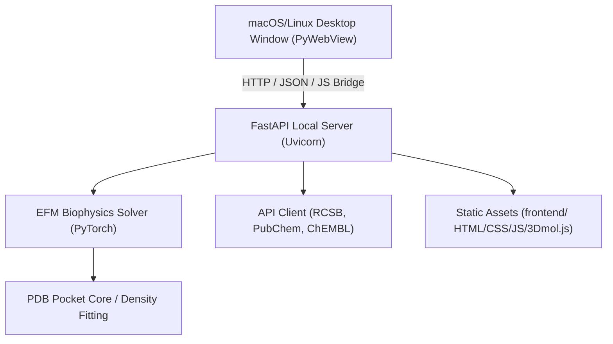

# Flux Chem Studio - Developer Guide

This document provides a technical guide for developers onboarding, extending, or building **Flux Chem Studio**.

---

## 1. System Architecture

Flux Chem Studio is structured as an offline-first desktop application consisting of a web-based GUI frontend and a Python-based biophysical solver backend.



### Frontend (`frontend/`)
- **`index.html` & `index.css`**: Core UI layout using premium dark-mode glassmorphism and modern flexbox-based LaTeX math notation formatting.
- **`app.js`**: Core UI logic, 3Dmol.js viewer initialization, events binding, and async endpoints interaction.
- **`docs.html` & `docs.css`**: In-app documentation, user guides, and interactive benchmarking suite interface.
- **`3Dmol-min.js`**: Local 3D molecular visualizer (100% offline compliant, no CDN dependency).

### Backend (`engine/`)
- **`server.py`**: FastAPI server handling local endpoints (`/fetch_target`, `/fetch_ligand`, `/run_screening`, `/run_evolution`, `/run_validation_benchmark`, `/run_statistical_validation`, `/version`). Serves static files and manages background statistical validation tasks.
- **`solver.py`**: The biophysical core. Solves the 3D density-dependent Nonlinear Klein-Gordon (NLKG) equation using PyTorch tensor operations.
- **`api_client.py`**: Local caching wrapper around RCSB PDB GraphQL, PubChem REST, and ChEMBL APIs.
- **`validation_pipeline.py`**: Statistical engine for regression validation. Calculates Pearson, Spearman, MAE, and generates calibration data.

---

## 2. Mathematical Equations

The Eholoko Fluxon Model (EFM) biophysical solver relaxes a complex matter wave field $\psi(\mathbf{r}, t)$ under a multi-centered nuclear core potential $V_{\text{nuc}}(\mathbf{r})$ using the damped wave Nonlinear Klein-Gordon (NLKG) equation:

$$\frac{\partial^2 \psi}{\partial t^2} + \delta \frac{\partial \psi}{\partial t} = c^2 \nabla^2 \psi - (m^2 + g|\psi|^2 + \eta|\psi|^4)\psi - V_{\text{nuc}}(\mathbf{r})\psi$$

Where:
- $\psi = \psi_r + i\psi_i$ is the complex scalar wave representing the system state.
- $\delta$ is the kinetic damping coefficient that forces convergence to the ground state.
- $m^2, g, \eta$ are the biophysical Periodic Table density constants corresponding to the Harmonic Density States (HDS 1: Core, HDS 2: Mantle, HDS 3: Binding).
- $V_{\text{nuc}}(\mathbf{r})$ is the multi-body nuclear core potential.

To prevent grid aliasing and singularities, the potential cores are regularized using State-Dependent Nuclear Shell Scaling (SDNS), where core size scales geometrically with atomic number $Z$:

$$V_{\text{nuc}}(\mathbf{r}) = \sum_i -Z_i \frac{\text{erf}(d_i / \sigma_i)}{d_i + \epsilon}$$

where $\sigma_i = \sigma_0 (R_H)^{Z_i}$, with EFM constants $R_H = 1.001227$ and $\sigma_0 \approx 0.956$ simulation units.

The docking score is computed from the relaxed field's **Specific Phase Friction** ($E_{\text{spec}}$), which measures matter wave gradient energy:

$$E_{\text{spec}} = \frac{\int |\nabla \psi|^2 \, d^3\mathbf{r}}{\int |\psi|^2 \, d^3\mathbf{r}}$$

The binding score shift $\Delta E$ is:

$$\Delta E = E_{\text{complex}} - E_{\text{target}}$$

To correct for ligand size bias, the score is normalized by the heavy atom count $N$ and atomic charges $Z_{\text{lig}}$:

$$S_{\text{EFM, corrected}} = \text{calculate\_efm\_score}(E_{\text{target}}, E_{\text{complex}}, \Delta E, Z_{\text{lig}}, N)$$


---

## 3. Development Workflow

### Prerequisites
- Python 3.9 to 3.13
- PyTorch, FastAPI, PyWebView, Uvicorn, NumPy, Requests
- **For Linux Development**: System-level GUI and WebKit libraries are required (e.g. `python3-gi`, `python3-gi-cairo`, `gir1.2-webkit2-4.1` on Debian/Ubuntu, or `webkit2gtk4.1` on Fedora/RHEL).

### Setting Up a Development Environment
1. Clone the repository.
2. Initialize virtual environment:
   ```bash
   python3 -m venv venv
   source venv/bin/activate
   ```
3. Install dependencies in editable mode:
   ```bash
   pip install -e .
   ```
4. Run the application locally:
   ```bash
   flux-chem-studio
   ```

### Running the Test Suite
Tests are written with `pytest`. Ensure the virtual environment is active:
```bash
# Run all tests
PYTHONPATH=. pytest

# Run specific unit/UI tests
PYTHONPATH=. pytest tests/test_solver.py
PYTHONPATH=. pytest tests/test_ui.py
```

---

## 4. Calibration & Statistical Benchmarks

### Class-Stratified Calibration Fits
Different target protein classes (Kinases, GPCRs, Nuclear Receptors, Proteases) require specific regression calibrations to map raw EFM scores to predicted $pK_i$ values:

$$pK_i = \text{Slope} \times S_{\text{EFM, corrected}} + \text{Intercept}$$

Calibration regression coefficients are maintained in `engine/server.py` inside `compute_calibration_for_class`.

### Re-running the 100-Target Validation Dataset
To update or recalibrate the validation statistics:
1. Compile the validation set (requires internet for initial caching):
   ```bash
   PYTHONPATH=. python scratch/compile_validation_set.py
   ```
2. Execute the validation pipeline:
   ```bash
   PYTHONPATH=. python engine/validation_pipeline.py 500 100
   ```
This updates `data/validation_results.json` and creates a detailed `docs/VALIDATION_REPORT.md`.

---

## 5. Building Standalone Desktop Executables

The build pipeline uses **PyInstaller** to package the application into a platform-native executable. Note that PyInstaller does not support cross-compilation; you must build on the target operating system.

```bash
# Activate virtual environment
source venv/bin/activate

# Install pyinstaller (if not present)
pip install pyinstaller

# Run the build script
python build_app.py
```

### Build Artifacts
- **On macOS**: Compiles a double-clickable macOS app bundle under `dist/Flux Chem Studio.app`.
- **On Linux**: Compiles a standalone directory containing the executable binary under `dist/Flux Chem Studio/`.
- The packaged executable includes all local frontend resources (`frontend/3Dmol-min.js`) and local benchmark data (`data/validation_dataset.json`), satisfying all offline-compliance requirements.
